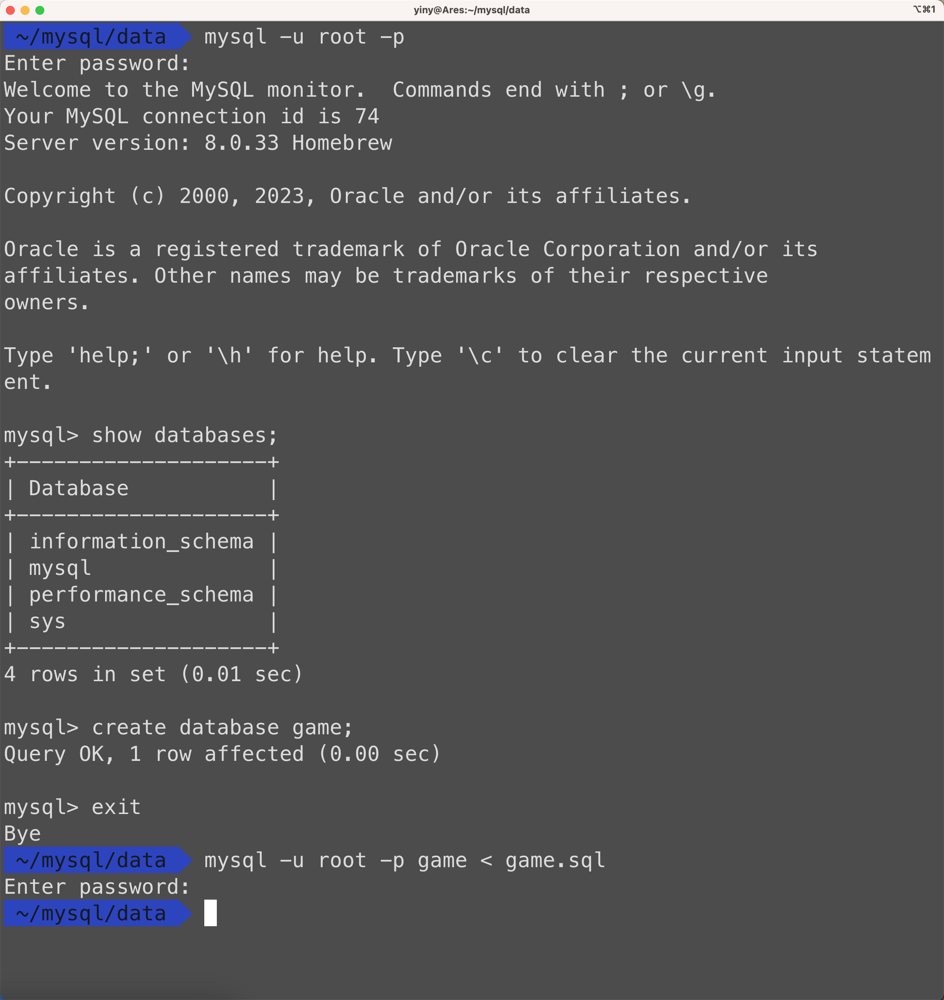

# README

_Read this in other languages:_
[_English_](README.en-US.md)

这是GeekHour的《一小时MySQL入门课程》中的配套数据，包括了课程中使用的SQL语句和数据文件。

## Course Links

* [YouTube](https://youtu.be/nZlH5in_660)
* [B站](https://www.bilibili.com/video/BV1AX4y147tA/)


## 数据的导入方法：

安装好MySQL之后，进入MySQL的命令行界面，创建一个名为game的数据库：
```sql
create database game;
```

然后退出MySQL的命令行界面，在终端中执行如下命令来导入数据：
```bash
mysql -u root -p game < game.sql
```

示例演示：


数据：


## 数据的导入方法：

安装好MySQL之后，进入MySQL的命令行界面并按照下面的步骤来创建一个数据库：

1. 打开终端，输入如下命令来登录MySQL：
```bash
mysql -u your_username -p
```
将your_username替换为你的MySQL用户名，然后会提示你输入MySQL密码。

登录成功后，你应该会看到MySQL的提示符：
```css
mysql>
```

2. 输入如下命令来创建一个名为game的数据库：
```sql
CREATE DATABASE game;
```
3. 你可以通过如下命令来确认数据库是否创建成功：
```sql
SHOW DATABASES;
```
4. 退出MySQL的命令行界面：
```sql
exit;
```
5. 在终端中执行如下命令来导入数据：
```bash
mysql -u root -p game < game.sql
```

里面还有一些其他数据，可以用来练习：

* city_data：中国省市区三级联动数据，包括各区域的经纬度和身份证前六位。
* game.npc： 三国题材游戏武将数据。
* company：  MySQL官方提供的示例公司数据。
* sakila：   MySQL官方提供的示例电影租赁数据。
* shop：     一个简单的电商数据，包括商品、订单、用户等信息。
* world：    MySQL官方提供的示例世界国家和城市数据。

示例：

